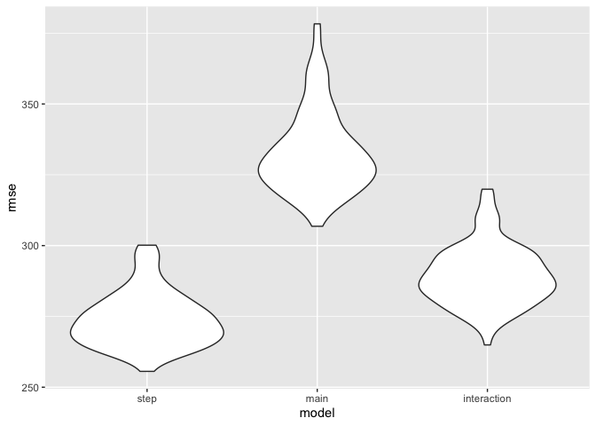

p8105_hw6_si2426
================
2022-11-20

## Problem 2

#### Loading and Cleaning Data

``` r
homicide_df = read.csv("./data/homicide-data.csv") %>% 
  mutate(city_state = paste(city, state, sep = ", "), 
         solved = ifelse(disposition == "Closed by arrest", 1, 0), victim_age = as.numeric(victim_age), victim_race = fct_relevel(victim_race, "White")) %>%
  filter(city_state != "Dallas, TX", city_state != "Phoenix, AZ",
           city_state != "Kansas City, MO",
           city_state != "Tulsa, AL") %>%
  filter(victim_race ==  "White" | victim_race ==  "Black")
```

The data was wrangled and cleaned by creating a variable for
`city_state` and a binary variable `solved` to identify cases that were
closed by an arrest. Several cities were filtered out and only victims
of White or Black ethnic backgrounds will be abalyzed.

``` r
baltimore_homicide = homicide_df %>% 
  filter(city == "Baltimore")

baltimore_logistic = 
  baltimore_homicide %>% 
  glm(solved ~ victim_age + victim_race + victim_sex, data = ., family = binomial()) 

baltimore_logistic_df = 
  baltimore_logistic %>% 
  broom::tidy() %>% 
  mutate(OR = exp(estimate)) 

baltimore_logistic_table = baltimore_logistic_df %>%
  dplyr::select(term, log_OR = estimate, OR, p.value) %>% 
  knitr::kable(digits = 3)

baltimore_logistic_table
```

| term             | log_OR |    OR | p.value |
|:-----------------|-------:|------:|--------:|
| (Intercept)      |  1.152 | 3.164 |   0.000 |
| victim_age       | -0.007 | 0.993 |   0.043 |
| victim_raceBlack | -0.842 | 0.431 |   0.000 |
| victim_sexMale   | -0.854 | 0.426 |   0.000 |

``` r
as_tibble(confint(baltimore_logistic)) %>% slice(4) %>% exp()
```

    ## Waiting for profiling to be done...

    ## # A tibble: 1 × 2
    ##   `2.5 %` `97.5 %`
    ##     <dbl>    <dbl>
    ## 1   0.324    0.558

A 95% confidence interval for the adjusted odds ratio for solving
homicides in Baltimore, Maryland in which the victim is male (keeping
all other variables fixed) is (0.32, 0.56). This indicates that
homicides in which the victim is male are less likely to be solved than
cases in which the victim is female in Baltimore, Maryland.

``` r
cities_logistic = homicide_df %>% 
  group_by(city_state) %>% 
  nest() %>%
  mutate( 
    models = map(data, ~glm(data = .x, solved ~ victim_age + victim_race + victim_sex, family = binomial())),
    result = map(models, broom::tidy)) %>%
  dplyr:: select(-data, -models)  %>% 
  unnest(result) %>%
  mutate(OR = exp(estimate)) %>%
  dplyr:: select(term, log_OR = estimate, std_error = std.error, OR, p.value) %>%
  mutate(lwr = exp(log_OR - 1.96*std_error), upr = exp(log_OR + 1.96*std_error))

cities_logistic =
  cities_logistic[, c("city_state", "term", "log_OR", "std_error", "OR", 
                      "lwr", "upr",
                      "p.value")]
```

``` r
victim_sex_logistic = cities_logistic %>% 
  filter(term == "victim_sexMale") %>%
  ungroup(city_state) %>%
  mutate(city_state = fct_reorder(city_state, OR))

ggplot(victim_sex_logistic, aes(x = city_state, y = OR)) + 
  geom_point() +
  geom_errorbar(aes(ymin = lwr, ymax = upr)) +
  labs(x = "City, State", y = "Adjusted Odds Ratio") +
  theme(axis.text.x = element_text(angle = 90, vjust = 0.5, hjust = 1))
```

<!-- -->

## Problem 3

#### Loading and Cleaning Data

``` r
birthweight_df = read.csv("./data/birthweight.csv") %>%
  mutate(babysex = as.factor(babysex),
         frace = as.factor(frace),
         malform = as.factor(malform),
         mrace = as.factor(mrace))
```

There does not appear to be any missing values in the data.

``` r
sapply(birthweight_df, function(x) sum(is.na(x)))
```

    ##  babysex    bhead  blength      bwt    delwt  fincome    frace  gaweeks 
    ##        0        0        0        0        0        0        0        0 
    ##  malform menarche  mheight   momage    mrace   parity  pnumlbw  pnumsga 
    ##        0        0        0        0        0        0        0        0 
    ##    ppbmi     ppwt   smoken   wtgain 
    ##        0        0        0        0

In order to study the relationship between birthweight and several
factors, we will fit a model with all variables and perform a stepwise
regression to find an appropriate model.

#### Fitting a Model

``` r
model = lm(bwt ~., birthweight_df)

step.model =  stepAIC(model, direction = "both", 
                      trace = FALSE)

step.model %>% 
  broom::tidy() %>% 
  dplyr::select(term, estimate, p.value) %>% 
  knitr::kable(digits = 3)
```

| term        |  estimate | p.value |
|:------------|----------:|--------:|
| (Intercept) | -6098.822 |   0.000 |
| babysex2    |    28.558 |   0.001 |
| bhead       |   130.777 |   0.000 |
| blength     |    74.947 |   0.000 |
| delwt       |     4.107 |   0.000 |
| fincome     |     0.318 |   0.069 |
| gaweeks     |    11.592 |   0.000 |
| mheight     |     6.594 |   0.000 |
| mrace2      |  -138.792 |   0.000 |
| mrace3      |   -74.887 |   0.077 |
| mrace4      |  -100.678 |   0.000 |
| parity      |    96.305 |   0.017 |
| ppwt        |    -2.676 |   0.000 |
| smoken      |    -4.843 |   0.000 |

Running the stepwise regression, we will be studying the relationship
between birthweight and the following independent variables: babysex,
baby’s head circumference, baby’s length, mother’s weight at delivery,
family income, gestational age, mother’s height, number of live births
prior to this pregnancy, mother’s pre-pregnancy weight, and average
number of cigarettes smoked per day.

#### Plotting Residuals

``` r
birthweight_df %>% 
  add_residuals(step.model) %>% 
  add_predictions(step.model) %>%
  ggplot(aes(x = pred, y = resid)) + 
  geom_point() +
  geom_hline(yintercept = 0, color = "red") +
  ggtitle("Residuals vs. Fitted Values") +
  xlab("Fitted Values") + ylab("Residuals")
```

<!-- -->

Looking at the residuals vs. fitted values plot, it appears that for
higher values of birthweight, the residuals are evenly distributed
around 0. However, for lower values of birthweight, the residuals tend
to be distributed greater than 0.

#### Comparing Models

In order to find the model that best predicts birthweight, we will use
cross validation to compare the stepwise model with two other models.
One model will look at length at birth and gestational age (main
effects) while the other model will look at head circumference, length,
sex, and all interactions.

``` r
cv_df =
  crossv_mc(birthweight_df, 100) %>% 
  mutate(
    train = map(train, as_tibble),
    test = map(test, as_tibble))

cv_df = 
  cv_df %>% 
  mutate(
    step.model  = map(train, ~lm(bwt ~ 
      babysex + bhead + blength + delwt + fincome + 
      gaweeks + mheight + mrace + parity + ppwt + smoken, data = .x)),
    main_effects = map(train, ~lm(bwt ~ blength + gaweeks, data = .x)),
    interaction = map(train, ~lm(bwt ~ bhead * blength * babysex, data = .x))) %>%
  mutate(
    rmse_step = map2_dbl(step.model, test, ~rmse(model = .x, data = .y)),
    rmse_main   = map2_dbl(main_effects, test, ~rmse(model = .x, data = .y)),
    rmse_interaction = map2_dbl(interaction, test, ~rmse(model = .x, data = .y)))

cv_df %>% 
  dplyr::select(starts_with("rmse")) %>% 
  pivot_longer(
    everything(),
    names_to = "model", 
    values_to = "rmse",
    names_prefix = "rmse_") %>% 
  mutate(model = fct_inorder(model)) %>% 
  ggplot(aes(x = model, y = rmse)) + geom_violin()
```

<!-- -->

According to the cross validation, it is apparent that the step-wise
model has the lowest RMSE value while the main effects model has the
highest RMSE. This means that it may be most appropriate to fit the
step-wise model to predict birthweight.
